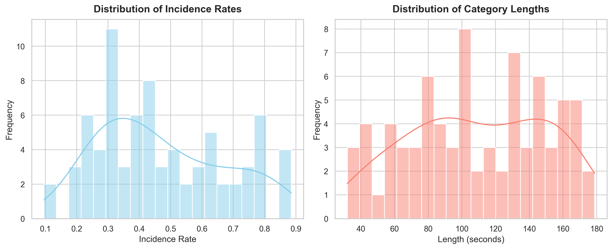
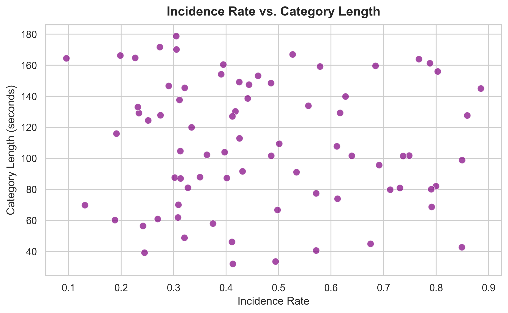
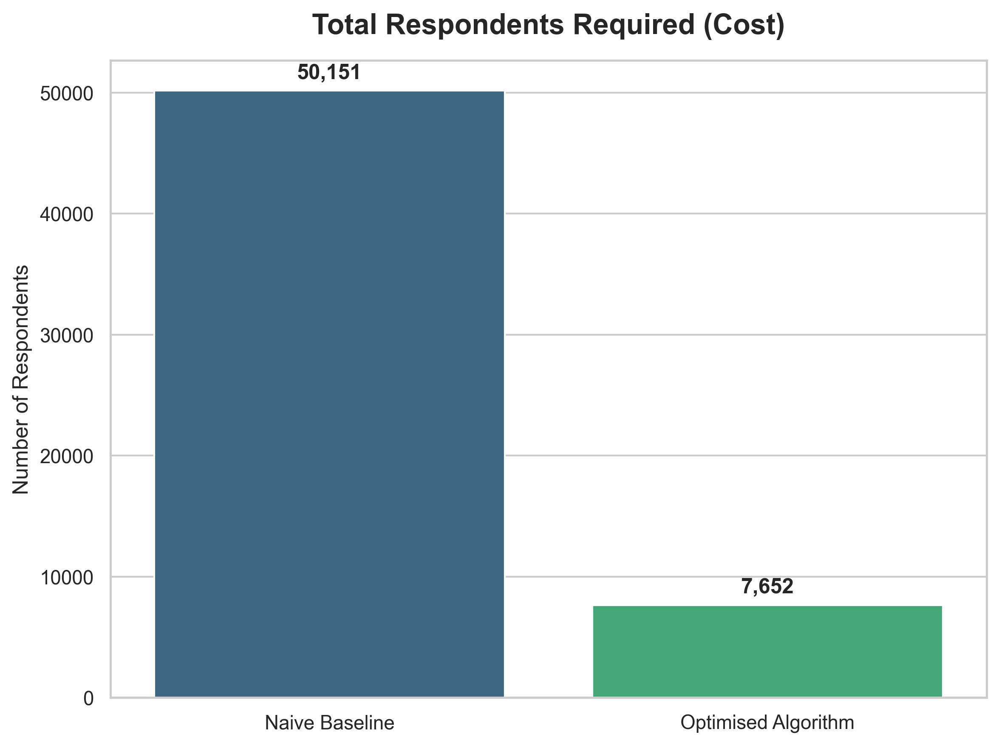
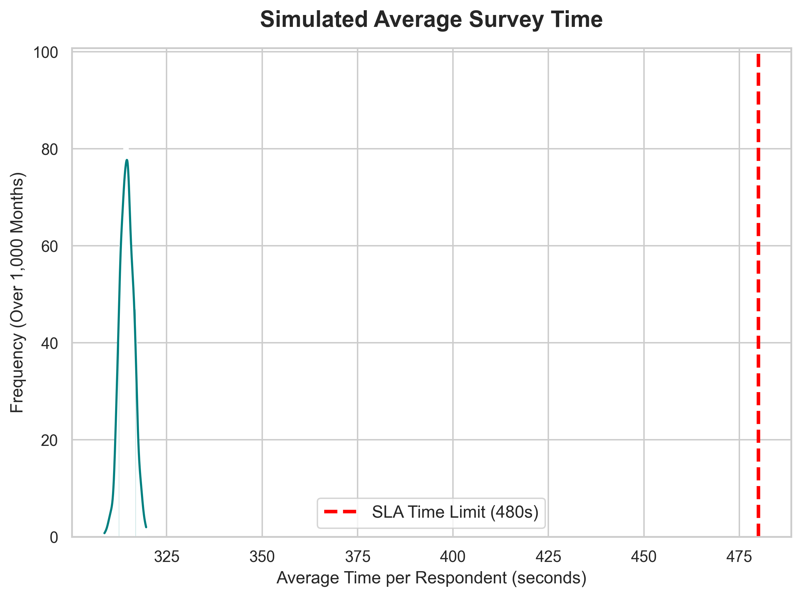
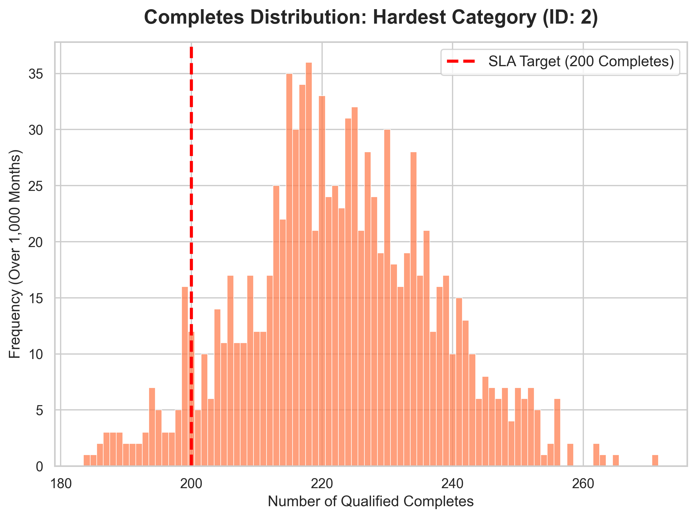

# Tracksuit Survey Routing Optimisation

## Executive Summary
This repository contains an algorithmic solution designed to minimise respondent acquisition costs while guaranteeing customer SLAs (200 completes), respecting strict survey time limits, and maintaining representative national demographics. 

By framing this as a **Greedy Bin-Packing** problem and utilizing statistical safety buffers, this algorithm achieves an **84.7% reduction in sampling costs** compared to a naive routing approach. At a hypothetical cost of 2.50 per respondent, this translates to 106,000+ in monthly panel cost savings (~$1.27M annually).

## Setup & Instructions
1. Install requirements: `pip install pandas numpy matplotlib seaborn`
2. Run Exploratory Data Analysis (EDA) visualisations: `python eda.py`
3. Run the core algorithm and validation suite: `python algorithm.py`
4. Generate algorithmic visual proofs: `python visuals.py`

*(Note: Key variables like Target Completes, Time Limits, Segment Pop-Splits, and Buffers can be easily adjusted in the `CONFIGURATION` block at the top of `algorithm.py`).*

---

## Exploratory Data Analysis (EDA)
Before designing the optimisation algorithm, I conducted an EDA to understand the shape and relationship of our two main constraints: **Category Rarity (Incidence Rate)** and **Survey Length**. 

### 1. Understanding the Distributions
Looking at the individual distributions, we see that the **Incidence Rates** are heavily skewed toward lower percentages (niche categories). This skew is exactly why a naive routing approach fails: grouping a rare 5% category with a common 80% category forces us to drastically over-sample the common one, wasting thousands of respondent dollars. 

Meanwhile, the **Category Lengths** show a wide variance, reinforcing the need for strict algorithmic time-capping to protect the 480-second SLA.

 

 

### 2. Correlation Check
Furthermore, as the scatter plot demonstrates below, there is **no strong correlation** between incidence rate and category length. 

 

 

This crucial data insight validated the algorithm's architecture: because length and rarity aren't correlated, we can safely sort and pack categories primarily by their *Effective Incidence Rate* without inadvertently clustering all the long surveys together and accidentally breaching the time limit.

---

## Defining the Mathematical Constraints
To solve this efficiently, we must translate Tracksuit's business rules into mathematical constraints for every individual category ($i$).

**1. Required Impressions (Minimising Cost)**
To get 200 qualified respondents, we must expose the category qualifier to enough people. Given an incidence rate $p_i$, the required number of respondents exposed is:
$$R_i = \frac{200}{p_i}$$

**2. Expected Time Contribution**
Because we are optimising for the *mean* respondent, we look at expected values. The expected time a category adds to a respondent's survey is the probability they qualify multiplied by the time the category survey takes ($t_i$):
$$E[T_i] = p_i \times t_i$$

**3. The Optimisation Constraint**
To ensure users do not exceed 8 minutes (480 seconds), categories must be grouped into distinct **Survey Blocks**. For any given block, the sum of expected times must respect the limit:
$$\sum_{i \in Block} E[T_i] \le 480$$

---

## The Approach & Creative Solutions

### 1. The Sorting Heuristic (Solving the Cost Problem)
A naive algorithm mixes rare categories with common ones. Because a survey block runs until its *rarest* category hits 200 completes, grouping a 10% category with an 80% category forces us to wildly over-survey the common category, wasting thousands of impressions. 
**Solution:** The algorithm calculates the Expected Time Load and sorts categories by rarity. Grouping categories with similar incidence rates ensures we optimise our respondent spend.
 

### 2. The Real-World "0-Second" Fix (Solving Respondent Fatigue)
The prompt notes that category qualifiers take 0 seconds mathematically. However, from a product perspective, hitting a single user with 50 sequential qualifying questions will cause massive survey abandonment and ruin data quality.
**Solution:** I implemented a `MAX_QUALIFIERS = 12` cap in the bin-packing algorithm. This solves the 0-second loophole, protecting real-world data quality while still achieving mathematical optimisation.

### 3. "Effective Incidence Rates" (Solving the Demographic Constraint)
Rather than building complex, dynamic quota-routing—which can introduce heavy technical debt and algorithmic bias—I handled demographics mathematically upstream. 
**Solution:** If "Self Tan (Female Only)" has a 20% incidence rate, it really has a 10.2% *Effective Incidence Rate* across the general population (20% × 51% female population). By calculating these effective rates first, we can simply expose our survey blocks to a completely randomised, nationally representative pool. 

**Going Beyond Age & Region (Marketing Personas):** While Age and Region are standard quotas, Tracksuit's clients (marketers) often buy against specific personas. The validation output of `algorithm.py` demonstrates that this "Effective Incidence" architecture scales perfectly. It seamlessly maps to marketing-specific segments like **Generation (Gen Z vs Boomer)**, **Ethnicity**, and **Household Income** without requiring any new routing logic or introducing bias.

---

## Validation
The included Monte Carlo simulation uses NumPy vectorisation to test the algorithm over 1,000 simulated months in a fraction of a second. It mathematically proves:

**1. Time Limits:** The 480-second constraint is never breached.
 

**2. SLA Compliance:** Due to our calculated 1.64 Z-score statistical buffer, even the worst-performing (rarest) category safely hits the 200 target ~94% of the time. (This buffer can be dynamically adjusted for higher certainty).
 

**3. Representation:** The population exposed to our Survey Blocks perfectly matches National Quotas across all tested demographic segments.
